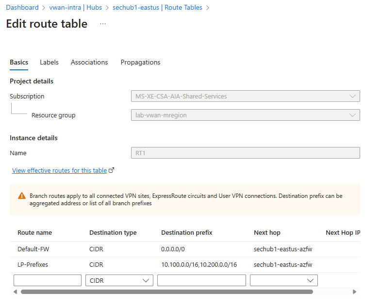

# Azure Virtual WAN: Incompatible vWAN hubs scenario

## Description

This design scenario depicts an (undocumented) incompatibility when mixing virtual hubs (secured hubs) with Routing Intent enabled and disabled.

## Background  

**Initial configuration**

1. A virtual WAN instance is created with a virtual hub (e.g., East US2)
1. The virtual hub (vhub1) has private connectivity to on-premises (either ExpressRoute or S2S VPN)
1. On-premises advertises (BGP) network prefixes to vhub1.
1. The vhub is a Secured hub (Hub with Azure Firewall integrated) and does NOT have Routing Intent enabled.
    1. The vhub uses multiple route tables for different connections and the route tables have a route to direct all traffic on connected spoke vNets to the local hub Azure Firewall (0.0.0.0/0 next hop Azure Firewall)
1. Traffic from on-premises can access Azure (spoke vNets connected to vhub1)
1. Traffic from Azure (spoke vNets connected to vhub1) can access on-premises

**vhub1 working state. Send and return traffic**

**vhub1 custom Route table configuration. Prefixes with next hop Azure Firewall**

**vhub1 custom Route table effective routes. Prefixes with next hop Azure Firewall**

**vhub1 Default Route table effective routes. Prefixes with next hop Azure Firewall**

## Region expansion

1. A Second vhub (vhub2) in a different region (e.g., West US2) is created in the same vWAN instance as Secured hub (Hub with Azure Firewall integrated) and DOES have Routing Intent enabled.
    1. vhub2 also has private connectivity to a 2nd on-premises location (either ExpressRoute or S2S VPN)  
    1. The 2nd location is also advertising (BGP) the same on-premises network prefixes to the vhub2.
    1. vhub2's Routing Intent configuration includes the on-premises prefixes
1. The 2nd on-premises location can access Azure 2nd region resources (spoke vNets connected to vhub2)
1. The Azure 2nd region resources (spoke vNets connected to vhub2) can access the 2nd on-premises location

**So what brakes??**

1. Traffic from 1st on-premises location CANNOT longer reach Azure (spoke vNets connected to vhub1)

**Why? ... asymmetric traffic**

1. The traffic sent from 1st on-premises location works as expected but the return traffic no longer works.

## Unexpected behavior explained

1. vhub2 Routing Intent configuration injects the on-premises prefixes to vhub2's Default route table.
1. vhub2 advertises the same routes to vhub1
1. vhub1 learns and injects the routes to the custom route tables.
1. The Spoke vNets connected to vhub1 prefers vhub2's (remote) routes because they are more specific routes (w.x.y.z/? vs 0.0.0.0/0).

**vhub1 custom Route table effective routes. On-premises prefixes with next hop "Remote Hub"**

**vhub1 Default Route table effective routes**

**Hold on... shouldn't vhub1 prefer the local gateway routes over the remote routes anyway?**

1. There is an internal (not documented) routing preference where a hub with routing intent enabled is preferred over hubs with routing intent disabled.
1. This applies regardless of the Hub Routing Preference (HRP) setting used in the hubs with routing intent disabled.

## Workarounds

1. In vhub1's (hubs with routing intent disabled) route tables add more specific or same route entries as the ones entered in the routing intent configuration on vhub2 with next hop Azure Firewall on vhub1. This will prevent prefer vhub2's (remote hub) to win over the vhub1 matching routes.  
1. Convert vhub1 to routing intent configuration (requires deleting  all custom route tables)

**vhub1 custom Route table configuration. Route entries with more specific prefixes are added**

**vhub1 custom Route table effective routes. On-premises prefixes with next hop local "Azure Firewall"**

## Lesson learned

vWAN PG discourages mixing Secured virtual hubs with Routing Intent enabled and Secured virtual hubs with Routing Intent disabled.